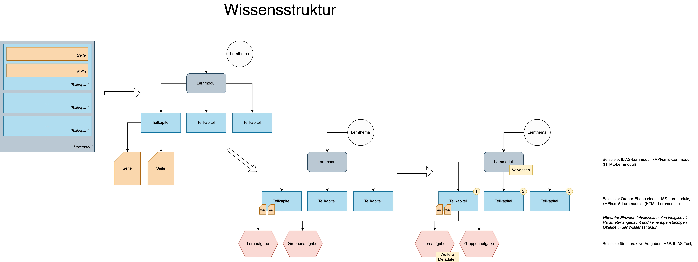

# Editor for VerDatAs project

> Idea: Creating a graphical editor for building knowledge structures

## Functional requirements

* A metamodel specifies the existing elements (and their dependencies)
* The editor allows building knowledge structure manually or using code (it must be possible to insert and connect
  elements by code)
* There must be an option to define attributes for elements (metadata)
* There must be an option to textually export the knowledge structure
* A general JavaScript editor is preferred that can be used in different frontend frameworks

## Technical requirements

Fast, scalable, maintainable application development using:

* _Typescript_ for type safety
* _Eslint, Prettier_ for enforcing clean code style
* _Vue_ for developing single-page applications using component composition and declarative rendering
* _Vite_ for setting up a fast and lean development environment
* _Vue Flow_ for creating interactive flow chart graphs

## Flowchart library comparison for vue.js

|                            | [Vue Flow](https://github.com/bcakmakoglu/vue-flow)    | [Drawflow](https://github.com/jerosoler/Drawflow) | [Diagram.js](https://github.com/bpmn-io/diagram-js) | [Flowy Vue](https://github.com/remcoplasmeyer/flowy-vue) | [Vue Diagrams](https://github.com/gwenaelp/vue-diagrams) |
|----------------------------|--------------------------------------------------------|---------------------------------------------------|-----------------------------------------------------|----------------------------------------------------------|----------------------------------------------------------|
| **Essential:**             |                                                        |                                                   |                                                     |                                                          |                                                          |
| Open Source                | x                                                      | x                                                 | x                                                   | x                                                        | x                                                        |
| Actively maintained        | x                                                      | x                                                 | x                                                   | x                                                        |                                                          |
| Documentation              | x (very good)                                          | x                                                 |                                                     | x                                                        |                                                          |
| Typescript                 | x                                                      | x                                                 |                                                     |                                                          |                                                          |
| Makes use of vue           | x                                                      |                                                   |                                                     | x                                                        | x                                                        |
| View-only component        | x (can be implemented, multiple synced views possible) | x (can be implemented)                            | x (can be implemented)                              | x (can be implemented)                                   | ?                                                        |
| State Import               | x                                                      | x                                                 | (external)                                          |                                                          |                                                          |
| State Export               | x                                                      | x                                                 | (external)                                          |                                                          |                                                          |
| Custom node types          | x (modified native nodes or even vue 3 components)     | ?                                                 | (external)                                          |                                                          |                                                          |
| Edge validation            | x                                                      | (external)                                        | (external)                                          |                                                          |                                                          |
| Customizable relation type | x                                                      | x                                                 | x                                                   | (only for hierarchies)                                   | x                                                        |
| Edit node attributes       | x (Editing mask is available + direct manipulation)    | (Nodes can incorporate forms)                     | (external)                                          |                                                          |                                                          |
| Edit edges via code        | x (call updateEdge)                                    | x (call updateConnectionNodes)                    | (external)                                          | ?                                                        |                                                          |
| **Optional:**              |                                                        |                                                   |                                                     |                                                          |                                                          |
| Drag & Drop                | x                                                      | x                                                 |                                                     | x                                                        | ?                                                        |
| Translate                  | x                                                      | x                                                 | x                                                   | x                                                        | ?                                                        |
| Zoom                       | x                                                      | x                                                 | x                                                   | x                                                        | x                                                        |
| Snap to grid               | x                                                      |                                                   | x                                                   | x                                                        |                                                          |
| Nesting of nodes           | x                                                      |                                                   |                                                     |                                                          |                                                          |
| Minimap                    | x                                                      |                                                   |                                                     |                                                          |                                                          |
| Highlighting               | x                                                      |                                                   |                                                     |                                                          |                                                          |

### Result

I would suggest **Vue Flow** since it seems to be the most flexible option, and it is very well documented (guide,
examples, etc.). An alternative could be Drawflow, but it looks like there are not as many options and flexibility.
Also, the documentation of Drawflow does
not involve any guide. Diagram.js is more general and does not build upon vue. Features like import/export and editing
of attributes seem to be added externally.

## Evaluation Feedback

Future work

* Undo event applies not for shifts + no keyboard support for undo/redo (implementation needed)
* (Optional): Auto alignment feature for arbitrary arrangements
* Visual feedback when selecting a node
* Delete-key for deleting edges and nodes needs to be communicated to users
* Add "Move to Position" option for inserting nodes
* Make undo/redo more resilient for arbitrary interactions (+locking, import, etc.)
* Implement help dialog that explains meta-model
* Create a color palette for node type color and state colors that can be perceived robustly
* Maybe hide empty mask when no node is selected
* Maybe add programmatic way to connect nodes (alternative to direct manipulation)
* Snapping is not well communicated to users
* Add localization for germany
* Teleport form next to selected nodes
* Implement redo/undo for form inputs
* Fix Drag & Drop Projection
